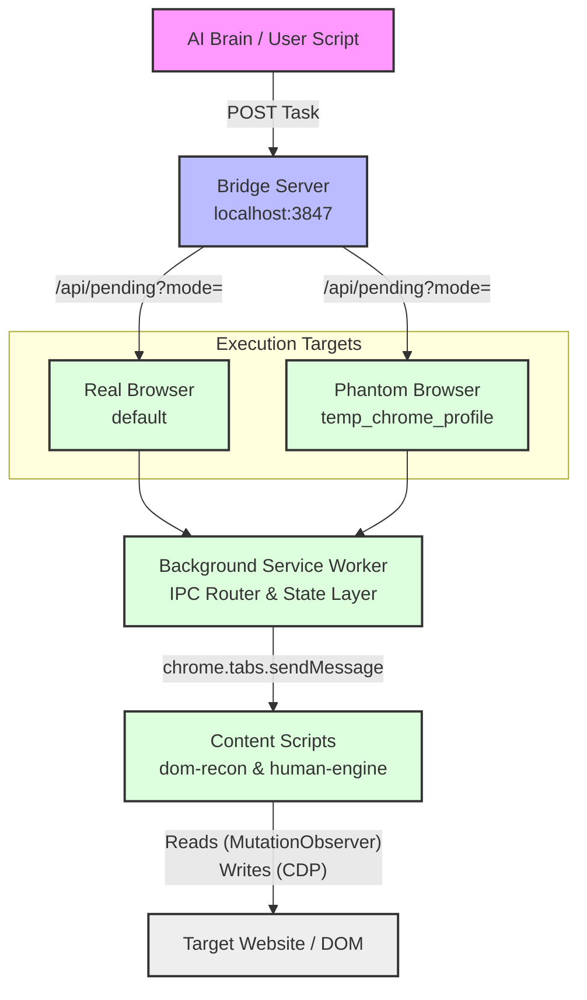
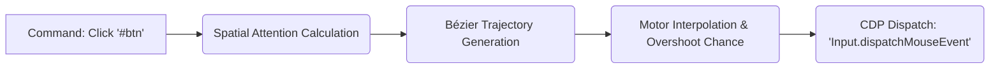

# POMDP Browser Agent — Complete Architecture Guide

## 1. Overview
The **POMDP Browser Agent** is a maximum-stealth, dual-execution browser automation system. Unlike traditional automation tools (like raw Puppeteer or Selenium) which are easily detected by modern anti-bot systems (Cloudflare, Datadome, reCAPTCHA v3), this extension interacts with websites *exactly* like a human. 

It accomplishes this by using a dataset-calibrated "**HumanEngine**" for biomechanics, a passive "**DOM Reconnaissance**" engine for perception, and a "**Target Routing Bridge**" to silently manage tasks across both visible and invisible (headless) browsers.

---

## 2. System Architecture

The ecosystem is divided into three distinct operational layers: The Bridge (Command & Control), The Extension (Perception & Actuation), and the Target Website (Domain).

---

## 3. Execution Modes (Target Routing)

The extension contains an intelligent routing system so you can simultaneously browse the web normally, while a ghost agent works in the background.

### Default Mode: The Real Browser
If a task is sent to the bridge server without explicit commands to run headlessly, it is picked up by your **Real Browser**. The agent will literally take over the current active tab and perform the task visibly. Highly useful for debugging, AI pair-programming, or workflows that require you to step in manually.

### Optional Mode: The Headless Ghost
If a task is tagged for the headless engine (by the bridge routing queue), it is sent exclusively to a **Headless Chrome Instance**. 
* Launched via `launch_extension.js` using Chrome's modern `--headless=new` flag.
* Utilizes a highly persistent `userDataDir` (`temp_chrome_profile`) so the headless ghost remembers cookies, logins, and sessions across restarts.
* Completely invisible to the user, allowing background task execution while you use your computer normally.

---

## 4. The "Eyes": DOM Reconnaissance (`dom-recon`)

The extension cannot act if it cannot see. The `dom-recon` system translates highly obfuscated visual websites into clean, JSON-based "Blueprints" that an AI Brain can read.

There are two sensing modes:

### ⭐ Observer Mode (Passive / Maximum Stealth)
This is the default and recommended mode for protected sites (Google, ChatGPT). It has a **zero-footprint**.
1. It uses `querySelectorAll` and `getBoundingClientRect` to passively read the DOM without triggering any synthetic events (`isTrusted: false`).
2. It attaches a silent `MutationObserver` to watch reality unfold.
3. If the page structure changes, it creates a "diff" and reports it back. 

### Active Probing Mode (Aggressive)
Used for mapping complex menus on sites without bot-detection. It shoots out synthetic hover, click, and keyboard events across the entire page to forcefully discover hidden menus, validation errors, and dialog boxes. Detectable, but highly effective for rapid UI mapping.

---

## 5. The "Muscle": Human Engine v4.0

When the agent decides to click a button or type a word, it strictly utilizes the `HumanEngine`. 

The engine does not teleport the mouse. The engine:
* **Generates Physical Movements:** Uses a 2MB database of `trajectory-segments.json` (Real human mouse movements captured from 10,000+ Captcha solves).
* **Simulates Human Flaws:** Calculates peak velocities, deceleration curves, and even occasionally overshoots the button intentionally (9.4% chance) to mirror real human imprecision.
* **CDP Execution:** Forces the simulated movement down to the OS-hardware level using the Chrome Debugger Protocol (CDP), meaning websites view the event as `isTrusted: true` (a real, hardware-triggered click), entirely bypassing Javascript event-listener traps.

---

## 6. Zero-Footprint Anti-Detection Mechanisms

To prevent websites from realizing they are being automated, the extension employs rigorous stealth hardening throughout its architecture:

1. **The Suppressed Debugger Banner:** The `launch_extension.js` passes the `--silent-debugger-extension-api` argument deep into Puppeteer, completely wiping out the "Started debugging this browser" warning strip at the top of Chrome.
2. **IPC Data Flow (Zero Backpack Labels):** The extension does not expose its sensitive trajectory databases to the internet. Instead of using `web_accessible_resources`, the `HumanEngine` requests data from the Background Service Worker via a secure, private `FETCH_JSON` IPC message.
3. **Scope Isolation:** The extension's internal memory does not exist on the global `window` object. Legacy code like `window.HumanEngine` was refactored into a closed block scope (`var BrowserAgent`). Therefore, anti-bot scripts attempting to scan the `window` object for automation flags will find absolutely nothing.
4. **Natural URL Avoidance:** When running an autonomous web-crawl, the recon tool intercepts URLs matching patterns like `logout`, `delete`, or `purchase`, preventing the agent from destroying data or breaking sessions.

---

## 7. The Workflow (How it operates)

If you wire an LLM (Large Language Model) up to the Bridge Server, this is how an autonomous scrape or execution occurs:

1. You command the LLM: *"Upload a video to Google Labs Flow."*
2. **Sensing:** The LLM asks the Bridge for the current page status. The Service Worker tells `dom-recon.js` to run a passive scan and returns the JSON Blueprint.
3. **Cognition:** The LLM reads the Blueprint, identifies the `aria-label="Upload File"` button, and notes its exact CSS Selector.
4. **Action:** The LLM sends a command back to the Bridge: `click('#upload-btn')`.
5. **Execution:** The Bridge routes it to the Headless Browser. The `HumanEngine` kicks in, simulates a curving, jittery mouse movement across the hidden screen, waits 400ms for cognitive processing, and fires a native CDP MouseClick.
6. The process restarts.
